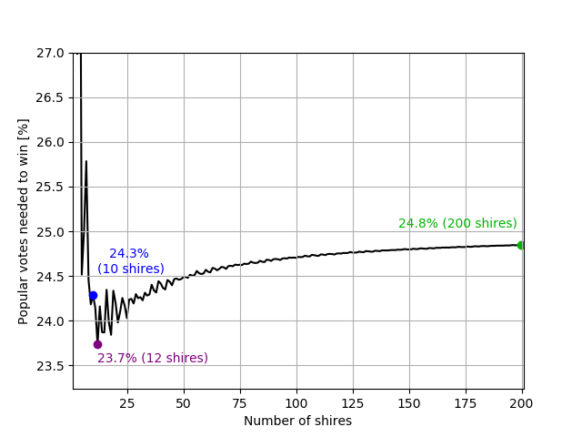

# township

This is my solution to the FiveThirtyEight Riddler express puzzle of 24/07/2020: https://fivethirtyeight.com/features/are-you-a-pinball-wizard/

The problem can be expressed as a knapsack problem. We have a knapsack where we want to fit all shires that are NOT won by the elected candidate. The weight of each shire is given by the number of electoral votes of the shire. The value of each shire is the minimum number of votes to win it, which are 6, 11, 16, ...  The knapsack capacity is then the complement of the number of electoral votes needed to win, since we're fitting in the shires NOT won. We want to maximise the value in the knapsack, which means we are NOT winning the largest possible number of popular votes.

With this setup, we can solve the problem with any method available for knapsack problems. Here I implemented both a dynamic programming (DP) solution and a branch & bound (BB) solution. DP will generally be more efficient, but for large number of shires it will require too much memory.

There are several possible solutions for 10 shires and the DP solver found the following:

  - Electoral votes won: 38 of 75 (50.7%)
  - Popular votes won: 136 of 560 (24.3%)
  - Shires won: 1, 2, 3, 4, 6 and 10

Interestingly, this solution includes the most populous shire, even though it gives us the least electoral votes per popular vote. It turns out to be more important to not overshoot the number of electoral votes won. Other equally good solutions are:

Shires won:
  - 1, 2, 3, 4, 7, 9
  - 1, 2, 3, 5, 6, 9
  - 1, 2, 3, 5, 7, 8
  - 1, 2, 4, 5, 6, 8
  - 1, 3, 4, 5, 6, 7

We can then search for solutions for any number of shires. Here is how the minimum percentage needed to win varies with number of shires:

